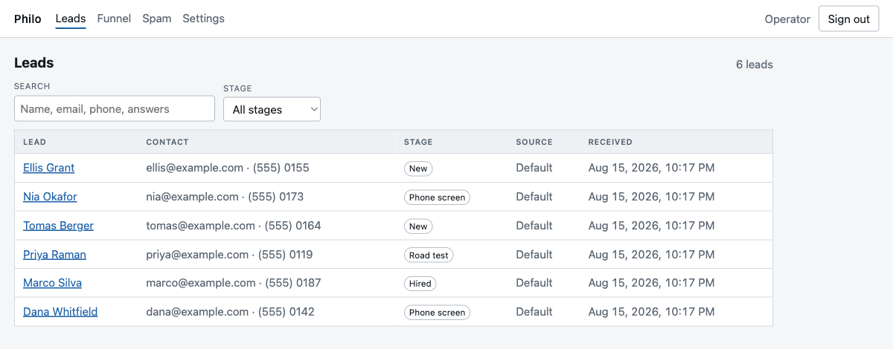
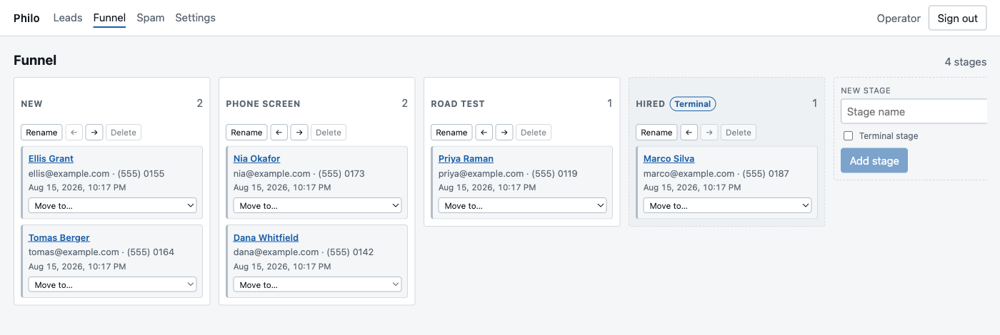
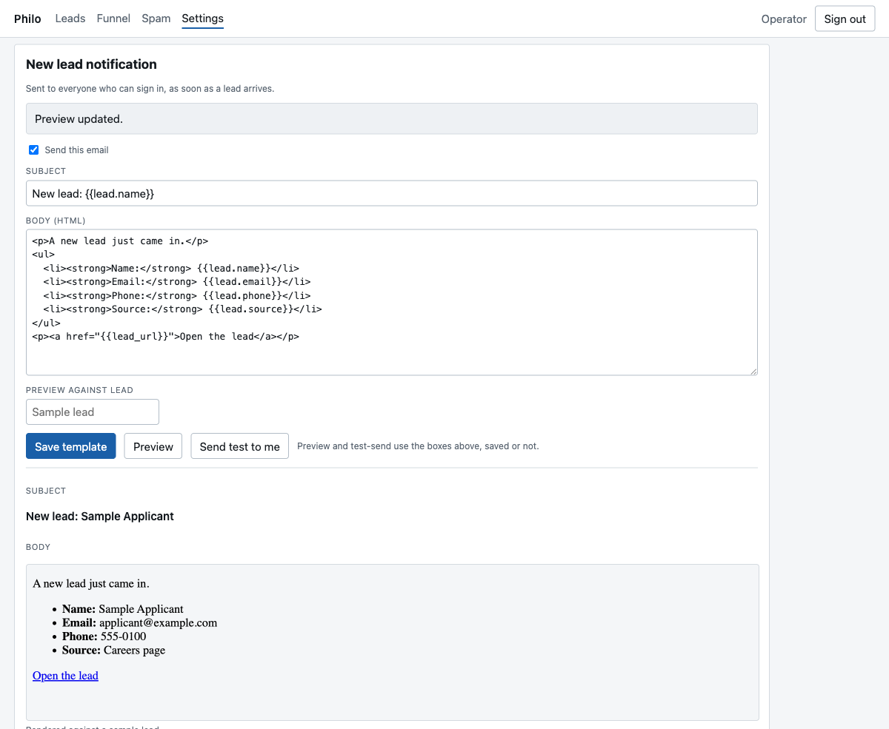
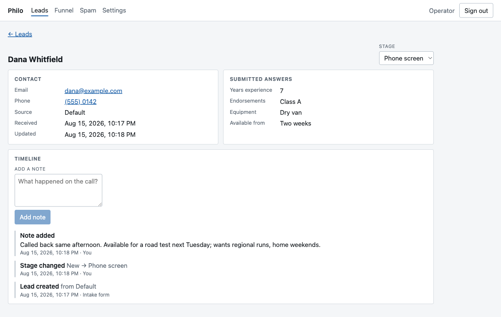

# Philo

A self-hosted, open-source **CRM** for small businesses.

Philo captures leads from your website, moves them through a funnel you define,
and notifies you the moment a new one arrives — push to your phone, email to
your inbox, and an acknowledgment to the person who applied or inquired.

**Deployment model: one instance per business.** Philo is deliberately
single-tenant. There is no organizations table, no tenant isolation, no plan
tiers — and there never will be. That simplicity is the product.



## Quick start

```bash
docker run -d --name philo --restart unless-stopped \
  -p 127.0.0.1:3000:3000 \
  -v philo-data:/data \
  -e PHILO_PUBLIC_BASE_URL=https://philo.example.com \
  -e PHILO_TRUSTED_PROXY=true \
  ghcr.io/philo-crm/philo:edge
```

Point a reverse proxy with TLS at `127.0.0.1:3000`, open your base URL, and the
first screen creates the admin account. Then `docker logs philo` — the boot log
prints the intake URL your website's form should POST to.

Do the setup screen **promptly**. It is reachable without credentials and closes
for good at the first success, so between the instance becoming publicly
reachable and you filling that form in, whoever gets there first becomes the
admin. On an instance with no data in it the fix is cheap — delete the volume
and start over — but it is easier not to need it.

Serve it over **https**. Browsers refuse push notifications outside a secure
context, and the session cookie is only marked `Secure` when the base URL is.

> **Tags:** the first release has not been cut yet, so `:edge` — built from
> every push to `main` — is the only published tag. Version tags and `:latest`
> arrive with `v0.1.0`.

Full walkthrough, including reverse-proxy examples and backups:
**[docs/DEPLOYMENT.md](docs/DEPLOYMENT.md)**. Mail setup:
**[docs/EMAIL.md](docs/EMAIL.md)**.

## What it does

**Lead intake.** A form on your existing website POSTs to
`/api/intake/{form_key}`. It takes JSON or a plain urlencoded form, so an HTML
form with no JavaScript works. Known field names map to columns; everything else
is kept as submitted, so adding a question to your form can never drop a
submission. A hidden honeypot field and a per-caller rate limit handle bots —
and a bot's submission is quarantined rather than dropped, so nothing vanishes
silently.

**A funnel you define.** Rename, reorder, add and remove stages to match how you
actually work. Every lead carries an append-only timeline: created, moved,
noted, emailed.



**Email that you write.** A notification to you and an acknowledgment to the
submitter, both Handlebars templates edited in the app, with a live preview and
a test-send. Any SMTP provider works. Email is the guaranteed channel — a failed
send is retried, and a restart mid-retry does not lose it.



**Push to your phone.** An installable PWA with Web Push. VAPID keys generate
themselves at first boot, so there is nothing to configure; on iOS the app walks
you through adding it to the Home Screen, which is what Apple requires before
push will work at all.

**Full-text search** over names, contact details, and every answer a form
submitted.



## Agent-usable from day one

MCP is a first-class surface, not a bolt-on. `POST /mcp` speaks streamable HTTP,
with read-and-write tools for leads and the email templates and a read of the
funnel — so an agent can pre-screen an applicant, write up the call, and advance
them to the next stage.

Two ways to authenticate, both bearer tokens:

- **An API key** from Settings, for Claude Code, a script, or a cron job.
- **OAuth 2.1**, for connector clients that will not hold a static key. Philo is
  its own authorization server: dynamic client registration, PKCE, refresh
  tokens, one login-and-consent page.

There is also a hand-written `GET /llms.txt` — a tour of every machine-facing
surface, written for an agent that has just arrived and has no credential yet.

The same service layer sits behind a conventional REST API at `/api/v1`, for
anything that would rather not speak MCP.

## What it will not do

- **Multi-tenancy.** One business, one instance, forever.
- **DOT driver qualification files**, FMCSA employment applications, background
  checks, MVR pulls, or anything FCRA-regulated. Philo's recruiting use case is
  pre-screening only, and it keeps collected PII minimal by design — no SSN, no
  licence number, no date of birth.

## How it is built

One Node process, one SQLite file, no other moving parts. TypeScript and Hono on
the server; a Vite/React PWA served by that same server; Drizzle for the schema;
SQLite FTS5 for search. All state — the database and the secrets Philo generates
for itself — lives in one directory, so **backup is copying that directory**.

The reasoning is written down: [docs/DESIGN.md](docs/DESIGN.md) for the
architecture, [docs/adr/](docs/adr/) for the contested calls.

## Documentation

| | |
|---|---|
| [docs/DEPLOYMENT.md](docs/DEPLOYMENT.md) | Running it, HTTPS, environment variables, backup, upgrades |
| [docs/EMAIL.md](docs/EMAIL.md) | SMTP setup, Resend walkthrough, deliverability, templates |
| [docs/DESIGN.md](docs/DESIGN.md) | Product and architecture |
| [docs/adr/](docs/adr/) | Architecture decision records |
| [CONTRIBUTING.md](CONTRIBUTING.md) | Development setup, tests, database changes |
| [AGENTS.md](AGENTS.md) | Guide for AI coding agents working on this repo |
| `GET /llms.txt` | On a running instance: the agent tour of its own API |

## Status

Every MVP feature is built and on `main`: intake, leads and funnel, the PWA,
push, email, API keys, MCP, and the OAuth server. No version has been tagged
yet, so `main` and the `:edge` image are what there is to run.

## Naming

| Thing | Value |
|---|---|
| Product name | Philo |
| Binary / package | `philo` |
| Docker image | `ghcr.io/philo-crm/philo` |
| Env var prefix | `PHILO_` |
| Database name | `philo` |
| Config dir | `~/.config/philo/` |

## Contributing

See [CONTRIBUTING.md](CONTRIBUTING.md). Philo is a sibling project of
[ollie](https://github.com/olliefms/ollie) and follows the same conventions:
DCO sign-off, conventional commits, trunk-based releases.

## License

[AGPL-3.0](LICENSE)
